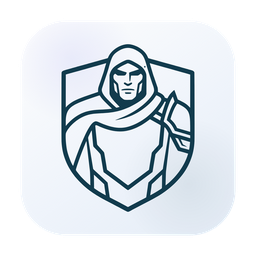
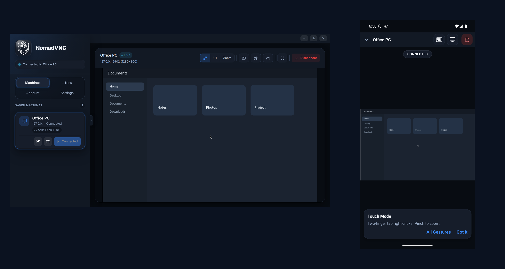
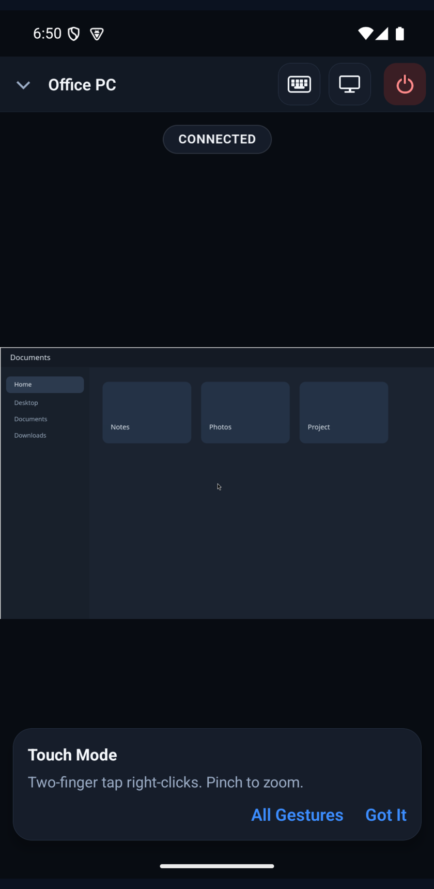

<p align="center">
  
</p>

<h1 align="center">NomadVNC</h1>

<p align="center">
  Remote desktop for any computer you have access to.<br />
  Linux, macOS, Windows, Android, and iOS.
</p>

<p align="center">
  <a href="https://greg.tech/nomadvnc/privacy">Privacy</a>
  ·
  <a href="https://greg.tech/nomadvnc/support">Support</a>
</p>

<p align="center">
  
</p>

NomadVNC is a free, open-source VNC client. It connects to a standard VNC
server, including macOS Screen Sharing, TigerVNC, WayVNC, TightVNC, and
UltraVNC.

On a local network, type an address and connect. No account. From somewhere
else, use any VPN that can reach the computer. Tailscale is built in: that
node runs inside the app and only carries NomadVNC traffic. Nothing else
on the computer joins the tailnet.

## What You Can Do

- Save a machine and connect again in one click. Passwords stay in the OS keychain.
- Send Super, Alt-Tab, and function keys to the remote machine. Copy and paste both ways.
- Fit the remote screen, view it at 1:1, zoom, or show one half of a wide display.
- On a phone, use Touch or Trackpad mode. A two-finger tap right-clicks. Pinch to zoom.
- On Windows, optional NomadVNC Host shares that PC, including the sign-in screen, and starts at boot with no window.

<p align="center">
  
</p>

## Download

Current release is 1.0.0. Installers for Linux, macOS (Apple Silicon),
and Windows, plus the optional Windows host, are on
[Releases](https://github.com/grpace/NomadVNC/releases).
The host is its own download. It is not inside the viewer installer,
and the viewer does not auto-update it. Until the builds are
code-signed, macOS Gatekeeper and Windows SmartScreen warn on first
launch. Install notes are in
[docs/guides/install.md](docs/guides/install.md).

Android is also there as `NomadVNC-<version>.apk`. Install that file
directly; the Play Store listing is not live yet. iOS is not on the
App Store yet. The iOS app runs on iPhone and iPad. Build it from
source with
[apps/mobile/NATIVE_SETUP.md](apps/mobile/NATIVE_SETUP.md).

## Quick Start

1. Turn on VNC on the computer you want to reach. On the same network, connect to its address. From somewhere else, use any VPN that can reach it. Tailscale is built into NomadVNC if you want that. [Setup guide](docs/guides/README.md) for macOS, Windows, and Linux. The Linux and Windows guides are also in the app under **Settings**. On Windows, NomadVNC Host is an optional companion. If you manage a fleet of computers, the [silent install](docs/guides/windows-macos-server.md#a-fleet-of-windows-pcs) configures each PC with one command and no setup window.
2. Open NomadVNC and choose **Local Mode**, or create an account.
3. Add the machine. Address, VNC port, and password, then **Save Machine** and **Connect**.
4. To use Tailscale, choose **Sign in with Tailscale** and approve the device in the browser. Any other VPN works too: connect to the address it gives the computer.

## Accounts

An account is optional. An email link syncs saved machines and encrypted
passwords between your devices, and lets you share a machine by email.
I run the account server the apps use by default. You can point them at
a server you run yourself, in one field. The server is in
[`backend/`](backend/) (Node.js and PostgreSQL, one Docker image). See
[docs/self-hosting.md](docs/self-hosting.md).

## Security

- Saved passwords use OS secure storage: macOS and iOS Keychain, Windows DPAPI, libsecret or KWallet on Linux, Android Keystore.
- Tailscale connections are WireGuard. Plain VNC on a local network is not encrypted. Use Tailscale, or another VPN, on a network you do not trust.
- With an account, the server stores synced passwords encrypted, and the server can decrypt them. Self-host if you want that under your control.

How to report a vulnerability: [SECURITY.md](SECURITY.md).
What is stored, and how to delete an account: [PRIVACY.md](PRIVACY.md).

## Documentation

| Guide | What It Covers |
|---|---|
| [Install](docs/guides/install.md) | Downloads, first launch, keyring setup |
| [Set Up a Computer](docs/guides/README.md) | VNC server, optional NomadVNC Host, silent fleet install, and any VPN |
| [Using NomadVNC](docs/guides/using-nomadvnc.md) | Zoom, pan, gestures, keyboard, clipboard |
| [Self-Hosting](docs/self-hosting.md) | Run your own account server and mail |
| [Architecture](docs/architecture.md) | How the pieces fit, security model, API |
| [Development](docs/development.md) | Build, test, and run from source |
| [Releasing](docs/releasing.md) | Viewer packages, the Windows host exe, CI, signing |

## Contributing

Bug reports, fixes, and ideas are welcome. See
[CONTRIBUTING.md](CONTRIBUTING.md).

```bash
pnpm install && pnpm build && pnpm test
pnpm desktop:dev
```

## License

[Apache-2.0](LICENSE). Third-party pieces keep their own licenses,
including noVNC (MPL-2.0). See
[THIRD_PARTY_NOTICES.md](THIRD_PARTY_NOTICES.md).

NomadVNC is an independent project. It is not affiliated with or endorsed
by Tailscale Inc.
